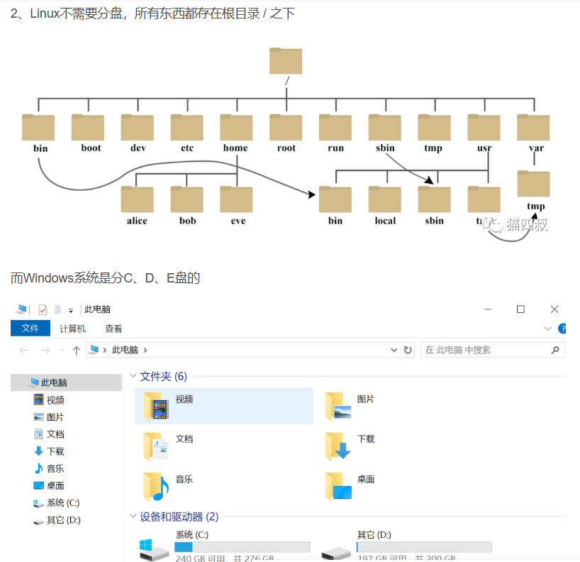

# Linux

### 第一课

虚拟机乌邦图（Ubuntu）的安装

md的使用（下载Typora、用法在网页https://www.toolhelper.cn/Code/Markdown）

善用网络资料：CSDN，github

### 命令行

我们所说的学习Linux，其实是学Linux的命令行。

> 相较于[Windows系统](https://so.csdn.net/so/search?q=Windows系统&spm=1001.2101.3001.7020)，Linux的图形界面并不是那么地好用，Linux稳定是说它在命令行界面下。
>
> Ubuntu 这样的机构“发行”了 Linux 内核以及所有必要的软件及实用程序（如网络管理器、软件包管理器、桌面环境等），使其可以作为一个操作系统使用，是 “Linux 发行版”。

`shutdown -h now`关机————【命令】【选项】【参数】

`命令 -h ` 或`命令 --help`  →显示这个命令的“说明书”

`↑`前一条指令

`history`→历史记录，可直接输入命令行前的序号调用这条命令

`Ctrl+D`终止当前进程

`Tab`自动补全

### 用户

我们可以使用不同身份登录进linux系统，user（用户）与root（类似于管理员）的权限不同，可以进行的操作相应地有所不同。

退出、登录的指令：

`sudo su`或`sudo -i`	→进入root（需要输入密码，且输入的内容不会在屏幕上显示，就输进去按回车就好了）

`exit`	→退出

### 权限

那么相应地，我们介绍到**权限**。

>前三个为属主位：创建该文件者或被指定的文件的所属者
>
>中间三个属组位：文件的所属组，在该组内的非属主用户对该文件拥有该属组权限
>
>最后三个Other位：Other用户，即不属于主又不在属组的用户

r:读权限          对文件，可以使用类似cat等命令查看文件内容	可以对此目录执行ls以列出内部的所有文件

w:写权限          对文件，可以编辑或删除此文件	可以在此目录创建文件：

x:执行权限	对文件，可以在命令提示符下当做命令提交给内核运行	可以使用cd切换进此目录，也可以使用ls -l查看内部文件的详细信息

### 文件夹（目录）✨

`ls`	→当前目录下的文件（夹），简洁版

`ll`	→当前目录下的文件（夹），详细版

`cd 文件夹名`	→进入文件夹

`cd ..`	→退出当前文件夹

`cd`	→退出全部文件夹

`pwd`	→显示路径

`echo $PATH`	→查看当前环境变量

`rm 文件名`	→删除文件

`rm -r`	→删除文件夹，慎用！

mv 	→重命名、移动文件

cp	→复制目录 `cp 来源 目标`

### 文件✨

`cat 文件名`	→查看文件内容

以下两个是编辑指令

> nano是一个字符终端的文本编辑器
>
> vi 是大多数linux系统自带的文字编辑器
>
> 而 vim 则是 vi 进阶版，可用不同颜色显示文字内容，也可进行各种程序的编写

**vim**

进入vim默认为命令模式，

命令模式→i/a/o→编辑模式

命令模式←Esc←编辑模式

注意光标只能靠按键移动，不能靠鼠标点击移动

| 按键           | 功能（存储与离开）  |
| -------------- | ------------------- |
| :w / :w!       | 保存/强制保存修改   |
| **:q / :q!**   | 退出/强制退出       |
| **:wq / :wq!** | 保存/强制保存后退出 |

**nano**

编译过后按下Ctrl+X退出会提示是否保存文件

N则直接退出，Y则进一步选择文件类型（M代表Alt键），若直接保存则按下enter键

### 安装卸载✨

`sudo apt-get install 软件名`	→安装

`sudo apt-get remove 软件名`	→卸载

> eg.vim

>在线安装
>
>sudo apt-get update：更新软件源
>
>sudo apt-get install vim：安装vim，这里的vim可以换成其他程序
>
>卸载程序
>
>sudo apt-get remove (vim)：卸载vim，这里的vim可以换成其他程序

（可以在下载具体某个东西的时候查CSDN）

### IP

`ip addr show `可以简写成`ip a`	→查询ip

------

常用指令了解熟悉，在使用中学习，想不起来的随时上网查，一搜就有。
